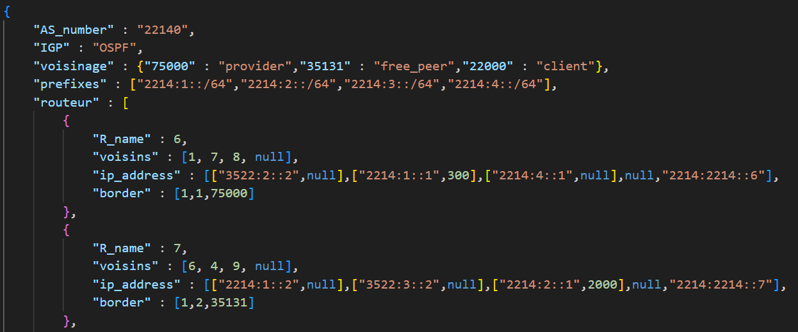

# GNS3_GRP_15

## Fonctionnalités

Notre script python *automatisation.py* permet de générer des fichiers de config supportant les fonctionnalités suivantes : 
* choix entre OSPF et RIP en IGP
* communication inter-AS par BGP
* assignation d'une métrique OSPF pour chaque interface
* utilisation de communautés BGP pour filtrage des routes propagées
* bot *drag and drop* afin d'automatiser le déplacement des fichiers de configuration

## Choix techniques

Nous avons fait plusieurs choix techniques pour la mise en place des différentes fonctionnalités décrites précédemment. Pour l'implémentation de la communication BGP, nous avons eu besoin de ***passive interface*** sur l'interface qui est reliée à un AS extérieur. Cela a été effectué en OSPF, mais ce n'était pas possible en RIP, nous avons donc usé de ***redistribute connected***.

Pour l'adressage des routeurs, nous sommes restés en adressage manuel, les adresses utilisées par les routeurs sont définies dans le fichier d'intention.

## Description du fichier d'intention

Le fichier d'intention suit l'architecture suivante : 

Notre fichier JSON est constitué d'une liste des différents AS de notre réseau, chaque AS comprend :
+ le numéro d'AS
+ l'igp de l'AS
+ les voisins BGP de l'AS avec leur relation (client / free_peer / provider)
+ les préfixes réseau à annoncer
+ les différents routeurs

Chaque routeur associé à un AS comprend les informations suivantes :
- le numéro du routeur
- les voisins du routeur, leur place dans la liste correspond à l'interface par laquelle ils sont reliés
- les adresses ip du routeur, leur place dans la liste correspond à l'interface à laquelle ils sont attribués, la métrique OSPF est aussi renseignée si elle a besoin d'être modifiée
- leur relation de bordure eBGP, le premier élément de la liste recense le nombre de voisins eBGP, puis les éléments sont associés 2 à 2 par voisins eBGP, le premier donne l'interface sur laquelle est relié ce voisin et le deuxième donne le numéro d'AS de ce voisin. Par exemple, pour le routeur 6 affiché au dessus, il a 1 voisin eBGP, connecté sur l'interface 1 et dont le numéro d'AS est 75000

Ces données sont ensuite structurées dans des classes AS et Routeur dans le script python.

## Utilisation

Tout d'abord, vous devez modifier l'intent file *Donnees_finale.json* selon vos besoins en suivant l'exemple vu précédemment. Puis exécutez le script *automatisation.py* qui générera les fichiers de configuration dans le dossier *Config_finale*. Si vous avez modifié l'architecture réseau, vous devez renseigner ,dans le script *deplacement.py*, le chemin d'accès du dossier dynamips de votre projet GNS3 et remplir le dictionnaire de correspondance des routeurs avec le nom de leur dossier de configuration. Une fois cela effectué, vous pouvez exécuter ce script qui déplacera vos fichiers de configuration au bon endroit.
